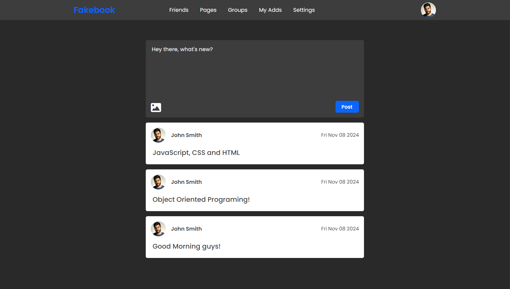
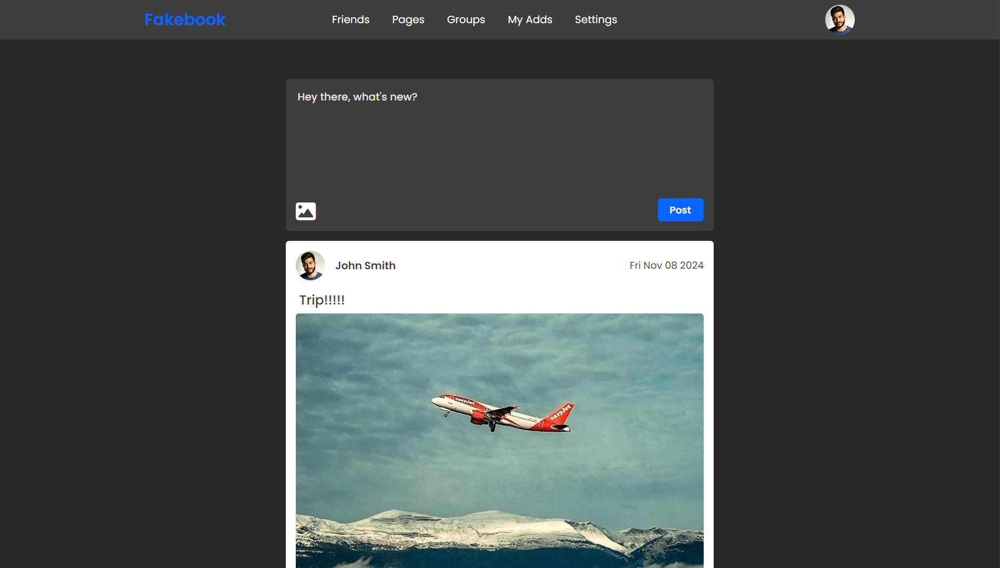
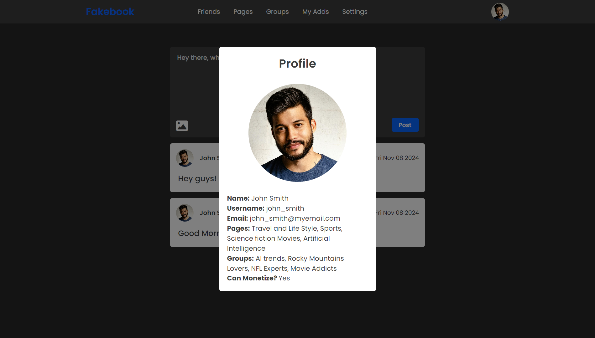

# Fakebook

Welcome to the Fakebook Project! This social media web application is inspired 
by popular social networking platforms. It enables users to create profiles, 
make posts, and upload images. The project was developed by Software Developer 
students at the Manitoba Institute of Trades & Technology (MITT).

Visit the website [here](https://fabianmendozaospina.github.io/fakebook/)



## Features 

The Fakebook Project is built using a combination of HTML, CSS, and JavaScript 
to create a dynamic and interactive user experience.

* User Profiles: Users can create detailed profiles including their name, 
username, email, pages they follow, groups they belong to, and monetization 
status.

* Dynamic Modal: A modal window displays user profile information dynamically 
when a user's profile is clicked. The modal shows the user's name, username, 
email, followed pages, groups, and monetization ability.

* Post Creation: Users can create new posts with text and upload images. 
Each post displays the user's profile picture, username, the post date, 
and the content.

* Intuitive User Interface: The UI is clean and simple, providing an intuitive 
experience for users to navigate through the app.


 
## Get Started

**To get started locally:**

1. Clone the Repository: Clone this repository to your local machine using:

```bash
git clone https://github.com/fabianmendozaospina/fakebook.git
cd fakebook
```

2. Open index.html: Open the index.html file in your favorite web browser to 
see the application in action.

3. Create Posts: Use the text area to write a post, and optionally upload an 
image. Click the "Post" button to publish your post.

4. View Profiles: Click on a user's profile to open the modal and view their 
profile details.



<br/>